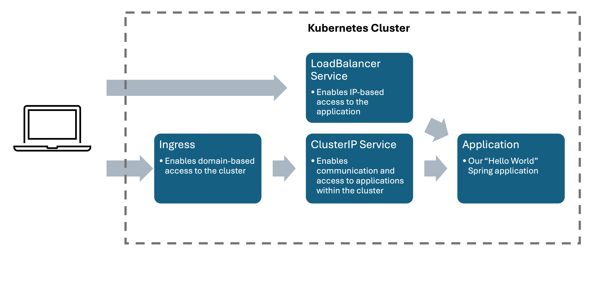

# Local Kubernetes Setup
## Prerequisites and System used for this Guide
- macOS Somna Version 14.5
- Docker with DockerID
  `brew install --cask docker`
- Minikube
  `brew install minikube`
- kubectl
  `brew install kubectl`
- Java 17 or later
- Maven

## Java Spring Web Application

### Fork the [CI/CD-Guide Project](https://github.com/thomasDACHPC/ci-cd-guide/tree/main)
The example project contains a simple Java Spring Web Application in
`src/main/java/com/example/spring_boot_docker/SpringBootDockerApplication.java`:
```
package com.example.spring_boot_docker;

import org.springframework.boot.SpringApplication;
import org.springframework.boot.autoconfigure.SpringBootApplication;
import org.springframework.web.bind.annotation.RequestMapping;
import org.springframework.web.bind.annotation.RestController;

@SpringBootApplication
@RestController
public class SpringBootDockerApplication {

	@RequestMapping("/")
	public String home() {
		return "Hello from the Kubernetes Cluster!";
	}

	public static void main(String[] args) {
		SpringApplication.run(SpringBootDockerApplication.class, args);
	}
}
```
When started, accessing [`http://localhost:8080/`]() will display the message returned by the *RequestMapping("/")-Method*. 
Stop the application before continuing.

### Package the Java Application
Use `./mvnw package` withing the project to package the application as .jar file.

## Containerization of the Application with Docker

### Write a Dockerfile to create an Docker Image of the Application
After packaging the application the next step is to containerize it and create an image.
In this guide a Dockerfile is used for this process.
Create a file called `Dockerfile` with the following content:
```
FROM amazoncorretto:21.0.4-alpine3.18
ARG JAR_FILE=target/*.jar
COPY ${JAR_FILE} app.jar
ENTRYPOINT ["java","-jar","/app.jar"]
```
This Dockerfile is used to set up a Java environment and copy our application into this environment. The entry point ensures that the application is executed directly when the container is started.

### Build the Docker Image
`docker build . -t spring-boot-app`\
The `-t` option tags the image as ***spring-boot-app***.
Note that the docker deamon has to run to execute the command (i.e. start Docker Desktop for example)

### Run a Docker Container (Optional)
You can test if the imaging process was successful by running the command\
`docker run -p 8080:8080 <image-id>`\
Again, accessing [`http://localhost:8080/`]() will display the message returned by the *RequestMapping("/")-Method*.
Please shut down the container before continuing.

### Push the Image to the Docker Container Registry (DockerID required)
Use the following command to push the image to the Docker Container Registry (Docker Hub). To be compliant with this guide use `cicdguideproject:v1.0.0` as `<docker-repository-name>:<tag>`.
`<docker-id>` is your docker username in lowercase.
```
docker tag <current-image-name> <docker-id>/<docker-repository-name>:<tag>
docker push <docker-id>/<docker-repository-name>:<tag>
```
The first command changes the name of the image and adds an optional tag (for example for versioning). The second command actually pushes the image to the container registry.

## Kubernetes
Now we are accessing the the universe of Kubernetes. Kubernetes, often abbreviated as K8s, is an open-source container orchestration platform designed to automate the deployment, scaling, and management of containerized applications. 
### Core Components of Kubernetes (generated by ChatGPT)
- **Cluster**: The set of nodes (machines) that run containerized applications managed by Kubernetes.
- **Node**: A single machine in the Kubernetes cluster. It runs containerized applications and is managed by the control plane.
- **Pod**: The smallest deployable unit in Kubernetes, which can contain one or more containers. Pods are designed to run a single instance of a given application.
- **Deployment**: A Kubernetes resource that manages a set of identical pods, ensuring the correct number of pods are running and updating them as needed.
- **Service**: An abstraction that defines a logical set of pods and a policy by which to access them, usually via an IP address or DNS name.
- **Namespace**: A way to divide cluster resources between multiple users. Namespaces are a way to organize objects in the cluster and are often used for multi-tenant environments.

### Setup Minikube on MacOs
Minikube is an open-source tool that allows you to run a single-node Kubernetes cluster on your local machine.
Minikube uses a hypervisor to create a virtual machine or a container runtime to simulate a Kubernetes environment.
Due to the limitations of the Docker driver on Apple Silicon Chips we will use a QEMU driver for virtualization.
The following commands will install QEMU and *socket_vmnet* which will allow Minikube to run `minikube tunnel` command if needed.
```
brew install qemu
brew install socket_vmnet
brew tap homebrew/services
HOMEBREW=$(which brew) && sudo ${HOMEBREW} services start socket_vmnet
```
The minikube cluster ist started with\
`minikube start --driver qemu --network socket_vmnet`.

### Prepare Minikube for Kubernetes Ingress
Later in this guide we will establish a Kubernetes Ingress. A corresponding addon has to be enabled in Minikube\
`minikube addons enable ingress`

### Create a Kubernetes Deployment File (deployment.yaml)
To tell Kubernetes which application and how many pods should be deployed a deployment configuration is necessary. A simple `deployment.yaml` file can be found in the project folder `deployment`.
```
apiVersion: apps/v1
kind: Deployment
metadata:
  name: spring-boot-app-deployment
  namespace: default
spec:
  replicas: 2
  selector:
    matchLabels:
      app: spring-boot-app
  template:
    metadata:
      labels:
        app: spring-boot-app
    spec:
      containers:
        - name: spring-boot-app
          image: thomasdachpc/cicdguideproject:v1.0.0
          ports:
            - containerPort: 8080
```
A few comments on this file:


```
kind: Deployment
metadata:
	name: spring-boot-app-deployment
	namespace: default
```

Metadata sets a unique name for the deployment and its namespace. For this guide, do not change the namespace.
```
replicas: 2
```
_Replicas_ defines how many pods of the application should be created by Kubernetes.

```
containers:
	- name: spring-boot-app
    	image: thomasdachpc/cicdguideproject:v1.0.0
        ports:
        	- containerPort: 8080
```
These lines of code set the application image which should be deployed by Kubernetes. The *image* is equivalent to `<docker-repository-name>:<tag>` in this case. 
The *containerPort* defines the port on which the application is accessible within the Kubernetes cluster.

For more information about deployments refer to the [Kubernetes documentation](https://kubernetes.io/docs/concepts/workloads/controllers/deployment/)!

### Create a Kubernetes Service File (service.yaml)
The next part is about the configuration of a service. Again, a simple `service.yaml` file can be found in the project folder `deployment`.
In Kubernetes, a Service is a method for exposing a network application that is running as one or more Pods in your cluster.
The first type of service we will use is the _load balancer_. It allows to access an application from the outside of the cluster.
```
apiVersion: v1
kind: Service
metadata:
  name: spring-boot-app-service
  namespace: default
spec:
  type: LoadBalancer
  selector:
    app: spring-boot-app
  ports:
    - protocol: TCP
      port: 81
      targetPort: 8080
```
A few comments on this file:

```
kind: Service
metadata:
	name: spring-boot-app-deployment
	namespace: default
```
Metadata sets a unique name and the namespace for the service. For this guide, do not change the namespace.

```
spec:
  type: LoadBalancer
  selector:
    app: spring-boot-app
  ports:
  - protocol: TCP
    port: 81
    targetPort: 8080
```
In these lines of code the type of the service is specified as well as the application.
All traffic arriving at port 81 of the service is forwarded to port 8080 of the application _spring-boot-app_.
The name has to match the corresponding naming in the deployment file.

### Apply the configuration files
Both files can be applied to the Kubernetes cluster by executing the following commands:
```
kubectl apply -f deployment/deployment.yaml
kubectl apply -f deployment/service.yaml
```

### Check status
After applying the configuration files check the cluster status with the following command:
```
kubectl get all
```
You should see two pods as well as a service of type LoadBalancer.
Looking at the LoadBalancer service the External-IP is _\<none\>_.
To access the service and the corresponding application from outside the cluster we have to create a routable IP.
### Create a Routable IP
In another terminal window issue the following command:
``` 
minikube tunnel
```
The terminal has to stay open.\
Check the status of the cluster again.
The LoadBalancer service should now have an External-IP.
Accessing `<IP>:81` with your browser should display the known message from the RequestMapping-Method.
At this point, you have deployed an application in Kubernetes and can access it from outside the cluster!


## Creating an Ingress (ingress.yaml, ingress-service.yaml)
An [Ingress](https://kubernetes.io/docs/concepts/services-networking/ingress/) exposes HTTP and HTTPS routes from outside the cluster to services within the cluster. 
Traffic routing is controlled by rules defined on the Ingress resource.
An Ingress may be configured to give Services externally-reachable URLs, load balance traffic, terminate SSL / TLS, 
and offer name-based virtual hosting. 
An Ingress controller is responsible for fulfilling the Ingress, usually with a load balancer, 
though it may also configure your edge router or additional frontends to help handle the traffic.

An example ingress configuration file as well as an ingress-service can be found in the deployment folder.
```
apiVersion: networking.k8s.io/v1
kind: Ingress
metadata:
  name: example-ingress
  namespace: default
  annotations:
    nginx.ingress.kubernetes.io/rewrite-target: /
spec:
  ingressClassName: nginx
  rules:
    - host: my-spring-boot-app.com
      http:
        paths:
          - path: /example
            pathType: Prefix
            backend:
              service:
                name: my-spring-boot-app-cluster-service
                port:
                  number: 81
```
Let us break down the Ingress configuration starting with the _spec_ section.
```
    - host: my-spring-boot-app.com
      http:
        paths:
          - path: /example
            pathType: Prefix
```
This part defines a base URL _my-spring-boot-app.com_  where the Ingress is accessible and an additional subpath _/example_.
The _pathType: Prefix_ indicates that every URL starting with _my-spring-boot-app.com/example_ is allowed to use to reach the Ingress (e.g. _my-spring-boot-app.com/example/anotherpath_).


```
              service:
                name: my-spring-boot-app-cluster-service
                port:
                  number: 81
```
The service-part defines the service and its port the Ingress is forwarding traffic to. In this case it is a ClusterIP service configured in the ingress-service file.
The configuration is similar to the previous LoadBalancer. A ClusterIP service enables the communication with an application only within the cluster.
Let us get to the _metadata_ section.
```
metadata:
  name: example-ingress
  namespace: default
  annotations:
    nginx.ingress.kubernetes.io/rewrite-target: /
```

Metadata contains the name and the namespace of the Ingress. 
Remember that base URL _my-spring-boot-app.com_ is defined a base URL for the Ingress. The annotation _nginx.ingress.kubernetes.io/rewrite-target: /_ ensures that every
URL will be rewritten as simple base URL before forwarding it to the application. This is important if the application does not support a subpath.
An example:
Our Spring applications method is annotated with _@RequestMapping("/")_ so it just listens to the base URL.
Our Ingress defines _my-spring-boot-app.com_ as base URL and _/example_ as a subpath.
Without rewriting to the base URL, accessing the Ingress via _my-spring-boot-app.com/example_ would lead to forwarding of _my-spring-boot-app.com/example_
to the application. Because the application just listens to _my-spring-boot-app.com_ we would get a _404 Not found_ error. With the rewrite annotation
_my-spring-boot-app.com/example_ will be rewritten and forwarded as _my-spring-boot-app.com/_ to the application.

---
Overall, our current cluster architecture looks like this:
\
\


In addition to accessing the application via the External-IP of the LoadBalancer service you can now use the URL _my-spring-boot-app.com/example_.
As _my-spring-boot-app.com_ is just a self defined URL your computer does not know how to resolve it to an IP address.
To solve this problem we need the Minkube IP address. We can get the address with `minikube IP`.
Note, that the Ingress is not accessible via the IP address only.
There are two options to use the URL to access the application:
1. Use a curl command and add the _--resolve_ option\
curl http://my-spring-boot-app.com/v2 --resolve "my-spring-boot-app.com:81:\<minikube IP\>"
2. Access your hosts file with `sudo nano /etc/hosts ` and add the following line of code. Saving the file enables to reach the domain URL my-spring-boot-app.com using your browser.\
`<minikube IP>   my-spring-boot-app.com`
## FluxCD

## Jenkins
Jenkins is an open-source automation server that is widely used for continuous integration (CI) and continuous delivery (CD) in software development. 
It helps automate parts of the software development process related to building, testing, and deploying applications, which leads to more efficient and reliable workflows.
To install Jenkins in your Kubernetes cluster follow sections [Kubernetes Jenkins Deployment](https://www.jenkins.io/doc/book/installing/kubernetes/#kubernetes-jenkins-deployment) 
and [Post-installation setup wizard](https://www.jenkins.io/doc/book/installing/kubernetes/#kubernetes-jenkins-deployment) of the official Jenkins handbook.